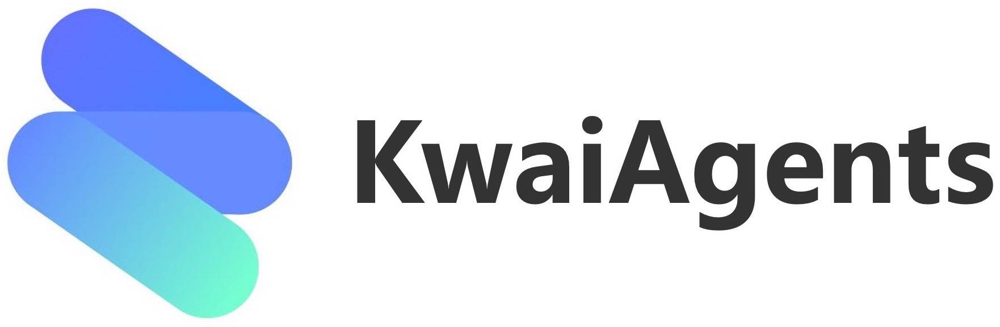
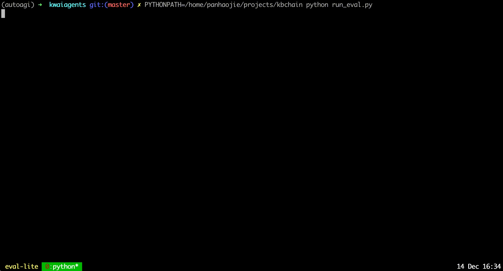
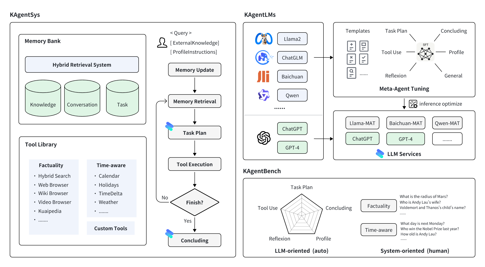

<div align="center">



# OrionAgent

### *Generalized Multi-LLM Agentic Intelligence Framework*

[](https://creativecommons.org/licenses/by-nc-sa/4.0/)
[](https://www.python.org/)
[](https://arxiv.org/abs/2312.04889)
[](https://huggingface.co/collections/kwaikeg/kagentlms-6551e685b5ec9f9a077d42ef)
[](https://huggingface.co/datasets/kwaikeg/KAgentInstruct)

**[📑 Research Paper](https://arxiv.org/abs/2312.04889) · [🤗 Models](https://huggingface.co/collections/kwaikeg/kagentlms-6551e685b5ec9f9a077d42ef) · [📊 Benchmark](https://huggingface.co/datasets/kwaikeg/KAgentBench) · [📚 Dataset](https://huggingface.co/datasets/kwaikeg/KAgentInstruct)**

</div>

---

## Overview

**OrionAgent** is a production-grade, open-source agentic AI framework built on top of large language models (LLMs) fine-tuned via **Meta-Agent Tuning (MAT)** — a novel alignment technique that enables models to reason, plan, use external tools, and self-reflect with significantly higher accuracy than vanilla prompt-engineered agents.

Originally developed by the **KwaiKEG** research team at [Kuaishou Technology](https://www.kuaishou.com/en), OrionAgent has been restructured and professionalized into a modular, extensible framework suitable for both research and enterprise deployment.

> **Key insight:** Unlike ReACT or Auto-GPT which rely entirely on prompt engineering, OrionAgent's LLMs are *natively trained* on 200K+ agent instruction samples, giving them intrinsic planning and tool-use capabilities that generalize across novel tasks.

<div align="center">


*OrionAgent autonomously decomposing a multi-step research query into tool calls and synthesizing a final answer.*
</div>

---

## Table of Contents

- [Why OrionAgent](#why-orionagent)
- [Architecture](#architecture)
- [Fine-tuned Models](#fine-tuned-models)
- [Benchmark Results](#benchmark-results)
- [Project Structure](#project-structure)
- [Installation](#installation)
- [Quick Start](#quick-start)
- [Configuration](#configuration)
- [Tool System](#tool-system)
- [Local Model Deployment](#local-model-deployment)
- [Evaluation](#evaluation)
- [Roadmap](#roadmap)
- [Citation](#citation)
- [License](#license)

---

## Why OrionAgent

Most existing agent frameworks are constrained by the ceiling of their underlying base LLM's instruction-following capability. OrionAgent breaks this ceiling through three pillars:

| Pillar | Description |
|--------|-------------|
| 🧠 **MAT Fine-tuning** | Models are trained on 200K+ diverse agent trajectories, not just prompted. Plans generalize across unseen tools and tasks. |
| 🔧 **Tool Orchestration** | Native support for web search, weather, browser automation, calendar, and solar term lookups — all composable |
| 📊 **Systematic Evaluation** | The only open-source agent with a 3,000+ sample human-verified benchmark covering 5 evaluation axes |

---

## Architecture

<div align="center">

</div>

OrionAgent's runtime is composed of four cooperating subsystems:

```
┌─────────────────────────────────────────────────────────────────┐
│                        OrionAgentSystem                         │
│                                                                 │
│  ┌────────────┐   ┌────────────┐   ┌───────────┐  ┌─────────┐ │
│  │  Planner   │──▶│ Tool Router│──▶│  Executor │─▶│Reflector│ │
│  │ (LLM Core) │   │(Dispatcher)│   │ (Actions) │  │(Critic) │ │
│  └────────────┘   └────────────┘   └───────────┘  └─────────┘ │
│         │                                                ▲      │
│         └────────────── Observation Loop ────────────────┘      │
└─────────────────────────────────────────────────────────────────┘
         │                                           │
    ┌────▼─────┐                              ┌──────▼────┐
    │  LLM API │                              │ Tool Suite│
    │(OpenAI / │                              │Search/Web/│
    │  Local)  │                              │Weather/...│
    └──────────┘                              └───────────┘
```

**Execution Flow:**
1. **Planner** receives the user query and produces a structured plan with sub-goals
2. **Tool Router** maps each sub-goal to the appropriate registered tool
3. **Executor** invokes the tool and collects observations
4. **Reflector** critiques the observation and either continues iteration or concludes
5. Final answer is synthesized and returned to the user

---

## Fine-tuned Models

OrionAgent ships with a family of MAT fine-tuned models, all available on HuggingFace:

| Base Model | Parameters | Specialization | HuggingFace Link |
|------------|-----------|----------------|-----------------|
| Qwen | 7B | General agent tasks | [kagentlms_qwen_7b_mat](https://huggingface.co/kwaikeg/kagentlms_qwen_7b_mat) |
| Qwen | 14B | High-accuracy planning & tool-use | [kagentlms_qwen_14b_mat](https://huggingface.co/kwaikeg/kagentlms_qwen_14b_mat) |
| Qwen 1.5 | 14B | Latest generation, best overall | [kagentlms_qwen1.5_14b_mat](https://huggingface.co/kwaikeg/kagentlms_qwen1.5_14b_mat) |
| Qwen | 7B (GGUF) | CPU inference via llama.cpp | [kagentlms_qwen_7b_mat_gguf](https://huggingface.co/kwaikeg/kagentlms_qwen_7b_mat_gguf) |
| Baichuan2 | 13B | Chinese-optimized tasks | [kagentlms_baichuan2_13b_mat](https://huggingface.co/kwaikeg/kagentlms_baichuan2_13b_mat) |

> **Recommendation:** For production use, deploy **Qwen1.5-14B-MAT** via vLLM for optimal accuracy. For resource-constrained environments, use the GGUF quantized model with llama.cpp.

---

## Benchmark Results

### Automated Benchmarks (KAgentBench — 3,000+ samples)

Evaluation across 5 dimensions: Planning, Tool-use, Reflection, Concluding, and Profile.

| Model | Scale | Planning | Tool-use | Reflection | Concluding | Profile | **Overall** |
|-------|-------|----------|----------|------------|------------|---------|-------------|
| GPT-3.5-turbo | — | 18.55 | 26.26 | 8.06 | 37.26 | 35.42 | 25.63 |
| Llama2 | 13B | 0.15 | 0.44 | 0.14 | 16.60 | 17.73 | 5.30 |
| ChatGLM3 | 6B | 7.87 | 11.84 | 7.52 | 30.01 | 30.14 | 15.88 |
| Qwen (base) | 7B | 13.34 | 18.00 | 7.91 | 36.24 | 34.99 | 21.17 |
| Baichuan2 (base) | 13B | 6.70 | 16.10 | 6.76 | 24.97 | 19.08 | 14.89 |
| ToolLlama | 7B | 0.20 | 4.83 | 1.06 | 15.62 | 10.66 | 6.04 |
| **Qwen-MAT (OrionAgent)** | **7B** | **31.64** | **43.30** | **33.34** | **44.85** | **44.78** | **39.85** ✦ |
| **Baichuan2-MAT (OrionAgent)** | **13B** | **37.27** | **52.97** | **37.00** | **48.01** | **41.83** | **45.34** ✦ |
| **Qwen-MAT (OrionAgent)** | **14B** | **43.17** | **63.78** | **32.14** | **45.47** | **45.22** | **49.94** ✦ |
| **Qwen1.5-MAT (OrionAgent)** | **14B** | **42.42** | **64.62** | **30.58** | **46.51** | **45.95** | **50.18** ✦ |

> ✦ OrionAgent's MAT models consistently outperform both base models and GPT-3.5-turbo at equivalent or smaller scale.

### Human Evaluation — Pass Rate & Quality Score

Results shown as `pass_rate% (avg_score/5.0)` across 100+ human-graded tasks.

| Model | Scale | No Agent | ReACT | Auto-GPT | **OrionAgentSys** |
|-------|-------|----------|-------|----------|-------------------|
| GPT-4 | — | 57.21% (3.42) | 68.66% (3.88) | 79.60% (4.27) | **83.58% (4.47)** |
| GPT-3.5-turbo | — | 47.26% (3.08) | 54.23% (3.33) | 61.74% (3.53) | **64.18% (3.69)** |
| Qwen-MAT | 7B | — | 58.71% (3.53) | 65.67% (3.77) | **67.66% (3.87)** |
| Baichuan2-MAT | 13B | — | 61.19% (3.60) | 66.67% (3.86) | **74.13% (4.11)** |

> **OrionAgentSys framework provides +5% to +16% absolute improvement** over vanilla ReACT across all tested model sizes.

---

## Project Structure

```
OrionAgent/
│
├── orionagent/                  # ✅ Core library (production package)
│   ├── __init__.py              #    Package entry & version
│   ├── agent_start.py           #    CLI entrypoint & argument parsing
│   ├── config.py                #    Runtime configuration loader
│   ├── agents/                  #    Agent orchestration logic
│   │   ├── kagent.py            #    Main agent loop (plan → act → reflect)
│   │   ├── agent_profile.py     #    Agent persona & instruction templates
│   │   └── prompts.py           #    System & user prompt construction
│   ├── tools/                   #    Pluggable tool integrations
│   │   ├── base.py              #    Abstract base class for all tools
│   │   ├── search.py            #    DuckDuckGo web search
│   │   ├── browser.py           #    Selenium-based web browsing
│   │   ├── weather.py           #    WeatherAPI integration
│   │   ├── calendars.py         #    Calendar & date utilities
│   │   ├── timedelta.py         #    Time difference calculations
│   │   ├── solarterms.py        #    Chinese solar terms lookup
│   │   └── commons.py           #    Shared tool utilities
│   ├── llms/                    #    LLM client abstractions
│   │   ├── __init__.py          #    LLM factory & registry
│   │   └── clients.py           #    OpenAI & local model clients
│   └── utils/                   #    Shared utilities
│       ├── chain_logger.py      #    Structured reasoning chain logger
│       ├── date_utils.py        #    Date parsing & formatting helpers
│       ├── function_utils.py    #    Function introspection utilities
│       ├── html_utils.py        #    HTML processing & cleaning
│       ├── json_fix_general.py  #    Robust JSON parsing & error recovery
│       ├── nlp_utils.py         #    Text processing & tokenization
│       └── selenium_utils.py    #    WebDriver lifecycle management
│
├── scripts/                     # 🔬 Evaluation & inference scripts
│   ├── benchmark_eval.py        #    Automated benchmark evaluation runner
│   ├── infer_qwen.py            #    Qwen model inference pipeline
│   └── infer_baichuan.py        #    Baichuan2 model inference pipeline
│
├── docs/                        # 📚 Documentation & examples
│   ├── quickstart.py            #    Quick start usage examples
│   ├── custom_tool_example.py   #    How to register custom tools
│   └── assets/                  #    Documentation images & media
│
├── configs/                     # ⚙️ Runtime configuration
│   └── default_config.yaml      #    Default agent & LLM settings
│
├── tests/                       # 🧪 Unit & integration tests
│
├── benchmark/                   # 📊 Benchmark data (original)
│   └── README.md                #    Benchmark methodology & instructions
│
├── blob/                        # 🖼️ Static assets (logo, screenshots)
│
├── .env.example                 # 🔑 Environment variables template
├── .gitignore
├── requirements.txt
├── setup.py
└── README.md
```

---

## Installation

### Prerequisites

- Python **3.10+**
- [Conda](https://docs.conda.io/en/latest/miniconda.html) (recommended for environment isolation)
- `git`

### Step 1 — Clone the Repository

```bash
git clone https://github.com/your-org/OrionAgent.git
cd OrionAgent
```

### Step 2 — Create Isolated Environment

```bash
conda create -n orionagent python=3.10 -y
conda activate orionagent
```

### Step 3 — Install Dependencies

```bash
pip install -r requirements.txt
pip install -e .
```

### Step 4 — Configure Environment Variables

```bash
cp .env.example .env
# Edit .env and add your API keys
```

Verify installation:
```bash
orionagent --help
```

---

## Quick Start

### Using OpenAI (Cloud)

```bash
export OPENAI_API_KEY=sk-xxxxx

orionagent \
  --query="What were the top 3 AI research papers published this week?" \
  --llm_name="gpt-4" \
  --lang="en"
```

### Using a Local MAT Model

```bash
orionagent \
  --query="Summarize the key advantages of transformer architectures." \
  --llm_name="kagentlms_qwen_14b_mat" \
  --use_local_llm \
  --local_llm_host="localhost" \
  --local_llm_port=8888 \
  --lang="en"
```

### Full CLI Reference

```
orionagent [OPTIONS]

Options:
  --id              ID of the conversation session
  --query           User query string (required)
  --history         Prior conversation history (JSON string)
  --llm_name        LLM identifier (e.g. "gpt-4", "kagentlms_qwen_7b_mat")
  --use_local_llm   Flag: use locally hosted model instead of OpenAI
  --local_llm_host  Hostname of local model server (default: localhost)
  --local_llm_port  Port of local model server (default: 8888)
  --tool_names      Comma-separated tool names to enable
  --max_iter_num    Max agent iterations before forced conclusion (default: 10)
  --agent_name      Custom agent display name
  --agent_bio       Short description of the agent's persona
  --agent_instructions  Behavioral instructions for the agent
  --external_knowledge  URL to external knowledge source
  --lang            Response language: "en" or "zh"
  --max_tokens_num  Maximum context length fed to the model
  -h, --help        Show this help message
```

---

## Configuration

OrionAgent supports file-based configuration via `configs/default_config.yaml`:

```yaml
agent:
  name: "OrionAgent"
  max_iterations: 10
  language: "en"

llm:
  provider: "openai"
  model_name: "gpt-4"
  temperature: 0.0
  max_tokens: 4096

tools:
  enabled:
    - web_search
    - weather
    - browse_website
    - get_date_time
```

CLI flags always **override** config file values.

---

## Tool System

OrionAgent ships with 6 built-in tools and supports unlimited custom tool registration.

| Tool | Description | API Required |
|------|-------------|-------------|
| `web_search` | DuckDuckGo real-time web search | No |
| `browse_website` | Full-page Selenium browser scraping | No (needs ChromeDriver) |
| `weather` | Current & forecast weather data | Yes (`WEATHER_API_KEY`) |
| `get_date_time` | Current date, time, and timezone | No |
| `time_delta` | Compute intervals between dates | No |
| `solar_terms` | Chinese traditional solar calendar | No |

### Registering a Custom Tool

```python
# docs/custom_tool_example.py

from orionagent.tools.base import BaseTool

class StockPriceTool(BaseTool):
    name = "get_stock_price"
    description = "Returns the current stock price for a given ticker symbol."

    def run(self, ticker: str) -> str:
        # Implement your API call here
        return f"${ticker}: $182.35 USD"

# Register and run with OrionAgent
# See docs/custom_tool_example.py for full integration instructions
```

---

## Local Model Deployment

### Option A — GPU Deployment via vLLM + FastChat (Recommended)

**Terminal 1:** Start the controller
```bash
python -m fastchat.serve.controller
```

**Terminal 2:** Launch the model worker
```bash
python -m fastchat.serve.vllm_worker \
  --model-path /path/to/kagentlms_qwen_14b_mat \
  --trust-remote-code
  # Add --dtype half if your GPU doesn't support BFloat16
```

**Terminal 3:** Start the OpenAI-compatible API server
```bash
python -m fastchat.serve.openai_api_server \
  --host localhost \
  --port 8888
```

---

## Evaluation

Run the benchmark evaluation against your deployed model:

```bash
cd scripts

# Step 1: Run model inference on benchmark set
python infer_qwen.py qwen_benchmark_results.jsonl

# Step 2: Score against ground truth
python benchmark_eval.py ./benchmark/benchmark_eval.jsonl ./qwen_benchmark_results.jsonl
```

---

## Roadmap

- [x] MAT fine-tuned Qwen 7B / 14B model release
- [x] MAT fine-tuned Baichuan2-13B model release
- [x] Qwen1.5-14B MAT model release
- [x] KAgentInstruct 200K dataset release
- [x] KAgentBench automated evaluation suite
- [ ] **v1.1** — LangChain & LangGraph tool bridge adapter
- [ ] **v1.2** — Multi-agent collaboration (Supervisor + Worker pattern)
- [ ] **v1.3** — Persistent memory module (episodic + semantic)
- [ ] **v1.4** — Web UI dashboard for agent chain visualization
- [ ] **v2.0** — Real-time streaming responses with SSE support

---

## Citation

If you use OrionAgent or its underlying research in academic work, please cite:

```bibtex
@article{pan2023kwaiagents,
  author    = {Haojie Pan and
               Zepeng Zhai and
               Hao Yuan and
               Yaojia Lv and
               Ruiji Fu and
               Ming Liu and
               Zhongyuan Wang and
               Bing Qin},
  title     = {KwaiAgents: Generalized Information-seeking Agent System
               with Large Language Models},
  journal   = {CoRR},
  volume    = {abs/2312.04889},
  year      = {2023},
  url       = {https://arxiv.org/abs/2312.04889}
}
```

---

## License

This project is licensed under the **Creative Commons Attribution-NonCommercial-ShareAlike 4.0 International License**.

[](https://creativecommons.org/licenses/by-nc-sa/4.0/)

---

<div align="center">

**Built with ❤️ on top of research from KwaiKEG × Kuaishou Technology**

</div>
